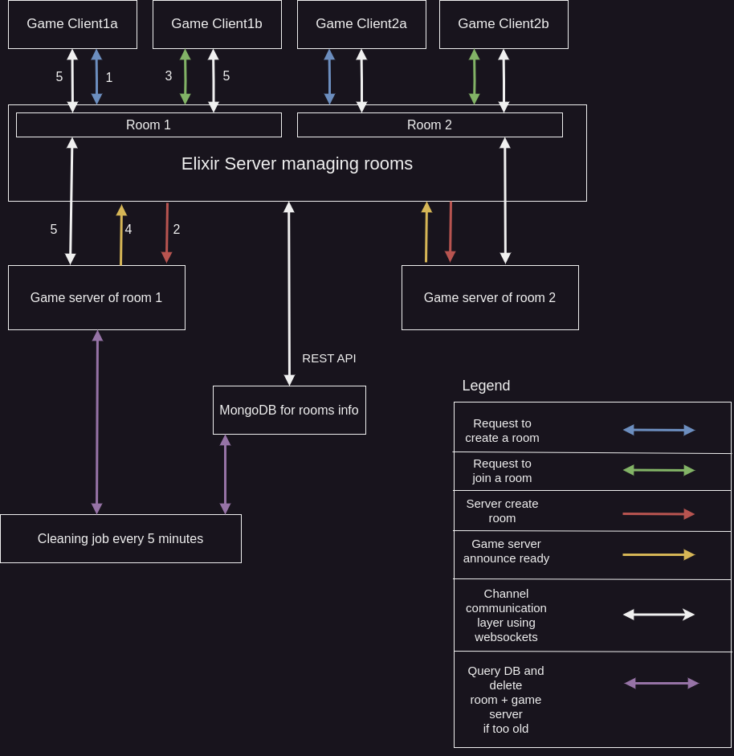

## Running in local

1. Start Mongodb using `sudo mongod --dbpath /path/to/folder`
   
2. Run the room server using `cd server && mix deps.get && mix phx.server`

3. Run the game client using `cd frontend && python3 src/game.py`

4. For cleaning the unused rooms in the database, you can use the following command `cd cleaner && mix cluster.clean` or make a cronjob of it

## Running on Kubernetes

1. First, you'll have to build the necessary images to run the server and the db on your Kubernetes cluster.
   This can be done by using the [`build.sh`](./build.sh) script and modifying it to your needs.

2. Deploy the room server to Kubernetes using the [`deploy.sh`](./deploy.sh) script

3. Wait for the deployments to come alive

4. Get the IP for the running server using `IP=$(kubectl get service/server -o jsonpath='{.spec.clusterIP}')`

5. Run the game client using `cd frontend && python3 src/game.py --host $IP:4000`

## Architecture of the system

